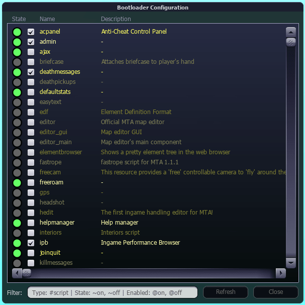
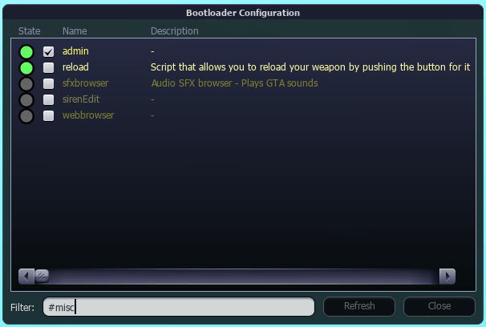
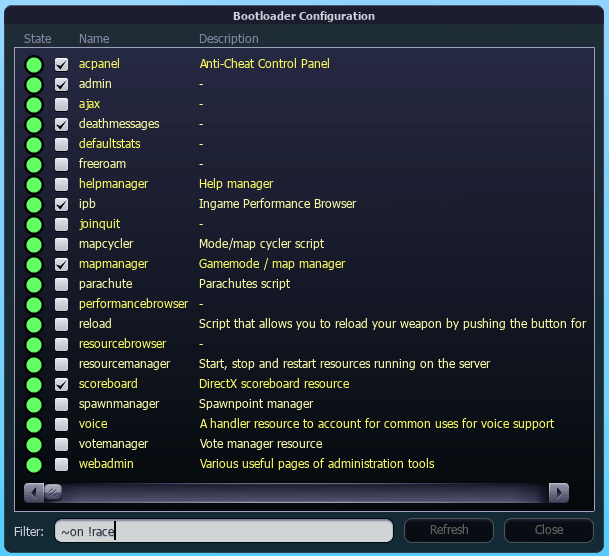

# Bootloader

A resource for server bootloading and resource keep-alive for a Multi Theft Auto server. Bootloading in the context of a MTA:SA server means this resource will start pre-configured resources in an undefined order. Furthermore, this bootloader will also keep pre-configured resources alive by checking the resource state with a timer - this behavior can be disabled. The act of enabling or disabling a resource in the bootloader is logged by the server. This resource is production-ready and can be used as-is.

## Installation

### Summary

1. Upload to your server's **resources** directory
2. Refresh your server with `/refresh` command
3. Grant ACL permissions with `/aclrequest allow bootloader all`
4. Add `command.bootloader` to **Admin** ACL permission list
5. Add bootloader to **mtaserver.conf** resource startup list

### How to install this resource

Place this resource in your server's **resources** directory to install it.

If your MTA:SA server is already running, you must execute the `/refresh` command (either as administrator or in the server console - without the slash prefix).

This resource has two ACL requests and it will __NOT__ work without these permissions, since they're essential to the functionality. This resource needs access to **startResource** and **stopResource** functions to start and stop other resources, respectively. You can grant these permissions with the command: `/aclrequest allow bootloader all`

For administrators to open the GUI configuration panel, they must be granted the permission to use the ACL right `command.bootloader`. You can do this either by manually editing your ACL.xml __AND__ executing `/reloadacl` on the server or by adding the right to the **Admin** ACL through the admin panel **Resources** tab.

This resource is meant to be put into your **mtaserver.conf** like this:
```xml
<resource src="bootloader" startup="1" protected="1"/>
<resource src="resourcebrowser" startup="1" protected="1" default="true"/>
<resource src="resourcemanager" startup="1" protected="1"/>
<resource src="mapmanager" startup="1" protected="0"/>
<resource src="race" startup="1" protected="0"/>
```

You should move the **bootloader** to the end of the resource list, if you encounter any issues. You should also mark the bootloader as `protected="1"` to prevent any user from stopping the resource.

## Configuration

The bootloader exposes a few resource-level settings, which you can set manually by editing **settings.xml** (not recommended) or by opening the resource configuration through the admin panel **Resources** tab.

| Setting          | Description                                        |
| ---------------- | -------------------------------------------------- |
| \*keepAlive      | Periodically start checked, but stopped, resources |
| \*showGamemodes  | Display gamemode resources in the GUI              |
| \*showMaps       | Display map resources in the GUI                   |
| \*showRaceAddons | Display race addon resources in the GUI            |

## Usage

You open the bootloader configuration with the `/bootloader` command. You can easily bind this command to any key (example: `/bind f4 bootloader`).

The configuration panel will receive the resource list in batches from the server (indicated by the loading spinner in the window title) to avoid hanging either the server or client. You can use the panel before the loading finishes.

Every line in the resource list of the bootloader GUI represents a single resource on the server. The circle indicates whether the resource is running (circle is green) or stopped (circle is gray). The checkbox indicates whether the resource is enabled for bootloading and keep-alive.


To find a resource in the resource list, you can apply several filters through the filter editbox in the configuration panel. The filter text is separated by whitespace and every *token* must match for a resource to appear.

You can filter by...

- resource name
- resource type with `#type` (corresponds to the `<info type="foo"/>` meta.xml value).
- resource state with `~on` or `~off` (read: is the resource running?)
- enabled state with `@on` or `@off` (read: resource is checked)

Any filter can be prefixed with a `!` to filter out results. By default, a filter includes a match in the resource list.


**NOTE:** By enabling a resource, the server will automatically start the resource.  
By disabling a resource, the server will automatically stop the resource.

## Screenshots







## License

Licensed under the [MIT](LICENSE.txt) license.
